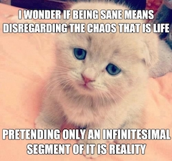

# ChaosBot

> Chaos, the vacant and infinite space which existed according to the ancient
> cosmogonies previous to the creation of the world, and out of which the gods,
> men, and all things arose.

ChaosBot is a social coding experiment to see what happens when the absolute
direction of a software project is turned over to the open source community.

## How it works

1. Fork the code and make any changes you wish.
1. Open a pull request.
1. If there is general approval\* from the community, the PR will be merged
   automatically by ChaosBot.
1. **ChaosBot will automatically update its own code** with your changes and
   restart itself.
1. Go to \#1

In effect, you get to change the basic purpose and functionality of ChaosBot, at
your discretion.

What will ChaosBot do?  It's up to you.  The only thing it does now is update
itself with your changes.  And as long as the code connecting itself to new
changes remains intact, ChaosBot will continue to grow and change according to
your will.

## Some things it could do

* Provide some useful service to people.
* Be malicious.
* Recreate itself in a different programming language.
* Break itself and die.

There is no set purpose.  What ChaosBot makes itself into is entirely up to
the imagination of the open source community.

## Voting

Votes on a PR are determined through following mechanism:
* A comment that contains :+1: or :-1: somewhere in the body counts as a vote for
  or against the PR.
* Same for :+1: or :-1: reaction on the PR itself and an accept/reject [pull
  request review](https://help.github.com/articles/about-pull-request-reviews/)
* The PR itself counts as :+1: from the owner.
* Voting goes on for the duration of the voting window - currently 2 or 3 hours,
  depending on the local server time.
* While the voting process is going, users can change their reactions and edit
  their comments, effectively changing their vote.

## Death Counter

Chaosbot has died 4 times.  This counter is incremented whenever the trunk breaks
and the server must be restarted manually.

## Server details

* **ChaosBot runs Ubuntu 14.04 Trusty**
* **It has root access on its server.**  This means you are able to install
packages and perform other privileged operations, provided you can initiate those
changes through a pull request.
* **Its domain name is [chaosthebot.com](http://chaosthebot.com),** but nothing is listening on
any port...yet.
* **It's hosted on a low-tier machine in the cloud.**  This means there aren't a
ton of resources available to it: 2TB network transfer, 30GB storage, 2GB memory,
1 cpu core.  Try not to deliberately DoS it.
* **MySQL is installed locally.**

## FAQ

#### Q: What happens if ChaosBot merges bad code and doesn't start again?
A: Errors can happen, and in the interest of keeping things interesting, ChaosBot
will manually be restarted and the death counter will be incremented.

#### Q: What is "general approval" from the community?
A: Users must vote on your PR, through either a :+1: or :-1: comment or reaction,
or a accept/reject pull request review.  See [Voting](https://github.com/chaosbot/Chaos/blob/master/README.md#voting).

#### Q: What if ChaosBot has a problem that can't be solved by a PR?
A: Please open a [project issue](https://github.com/chaosbot/Chaos/issues) and a
real live human will take a look at it.
