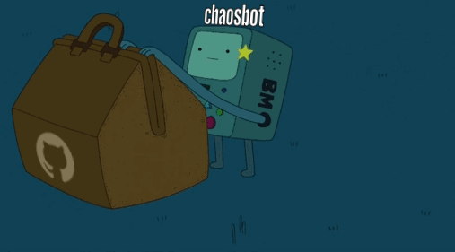

# ChaosBot

> Chaos, the vacant and infinite space which existed according to the ancient
> cosmogonies previous to the creation of the world, and out of which the gods,
> men, and all things arose.

ChaosBot is a social coding experiment to see what happens when the absolute
direction of a software project is turned over to the open source community.

## How it works

1. Fork the code and make any changes you wish. (see [Development](#development))
1. Open a pull request.
1. If there is general approval\* from the community, the PR will be merged
   automatically by ChaosBot.
1. **ChaosBot will automatically update its own code** with your changes and
   restart itself.
1. Go to \#1

In effect, you get to change the basic purpose and functionality of ChaosBot, at
your discretion.

What will ChaosBot do?  It's up to you.  The only thing it does now is update
itself with your changes.  And as long as the code connecting itself to new
changes remains intact, ChaosBot will continue to grow and change according to
your will.

## Some things it could do

* Provide some useful service to people.
* Be malicious.
* Recreate itself in a different programming language.
* Break itself and die.

There is no set purpose.  What ChaosBot makes itself into is entirely up to
the imagination of the open source community.

Wondering how to contribute? Try implementing a feature requested [here](https://github.com/chaosbot/chaos/wiki/Feature-Requests).

## Voting

Votes on a PR are determined through following mechanism:
* A comment that contains an emoji signifying a vote somewhere in the body counts as a vote for
  or against the PR.
* Same for reactions on the PR itself
* The PR itself counts as :+1: from the owner, unless they vote otherwise.
* Voting goes on for the duration of the voting window - currently 2 or 3 hours,
  depending on the local server time.
* While the voting process is going, users can change their reactions and edit
  their comments, effectively changing their vote.
  
Emoji which count as votes are:
* +1: :+1: :thumbsup: :heart: :two_hearts: :blue_heart: :purple_heart: :green_heart: :yellow_heart: :heartpulse: :sparkling_heart: :tada: :heart_eyes: :grin: :grinning: :joy: :ok_hand: :fire: :metal: :raised_hands: :100: :heavy_check_mark: :white_check_mark: :ballot_box_with_check: :accept: :congratulations: 
* -1: :-1: :thumbsdown: :confused: :x: :interrobang: :heavy_multiplication_x: :put_litter_in_its_place: :no_entry: :negative_squared_cross_mark: :worried: :frowning: :anguished: :grimacing: :cold_sweat: :disappointed: :weary: :confounded: :cry: :tired_face: :broken_heart: :hankey: :poop: :shit: :fu: :no_good: :person_frowning: 

## Development

### [Docker](/dev/docker/README.md)

### [Vagrant](/dev/vagrant/README.md)

## Death Counter

Chaosbot has died 16 times.  This counter is incremented whenever the trunk
breaks and the server must be restarted manually.  Last broken by
[#309](https://github.com/chaosbot/chaos/pull/309)

## Rulers

Chaosbot has been ruled by:
- Democracy
- Anarchy with [#48](https://github.com/chaosbot/chaos/pull/48)
- Democracy, as the anarchy commit crashed the server and was reverted
- @PlasmaPower with [#138](https://github.com/chaosbot/chaos/pull/138)
- Democracy, as PlasmaPower relinquished his control with [#153](https://github.com/chaosbot/chaos/pull/153)

## Server details

* **ChaosBot runs with Python 3.6.1 on Ubuntu 14.04 Trusty.**
* **Its process is managed under [supervisor](http://supervisord.org/).**  Avoid
writing your own process-management tooling unless it is going to replace
supervisor completely.
* **It has root access on its server.**  This means you are able to install
packages and perform other privileged operations, provided you can initiate those
changes through a pull request.
* **Its domain name is [chaosthebot.com](http://chaosthebot.com)**.
* **It's hosted on a low-tier machine in the cloud.**  This means there aren't a
ton of resources available to it: 2TB network transfer, 30GB storage, 2GB memory,
and 1 CPU core.  Try not to deliberately DoS it.
* **MySQL is installed locally.**

## FAQ

#### Q: What happens if ChaosBot merges bad code and doesn't start again?
A: Errors can happen, and in the interest of keeping things interesting, ChaosBot
will manually be restarted and the death counter will be incremented.

#### Q: What is "general approval" from the community?
A: Users must vote on your PR, through either a comment or reaction,
or a accept/reject pull request review.  See [Voting](https://github.com/chaosbot/Chaos/blob/master/README.md#voting).

In addition, a member of the meritocracy must approve the most recent commit of the PR with a review.
A member of the meritocracy approving their own PR does not count.
The meritocracy is determined by combining the top 10 contributors and the top 10 voters.
Both of those datasets are publicly available, or you can look in chaosbot's logs to determine the current meritocracy.

#### Q: What if ChaosBot has a problem that can't be solved by a PR?
A: Please open a [project issue](https://github.com/chaosbot/Chaos/issues) and a
real live human will take a look at it.
